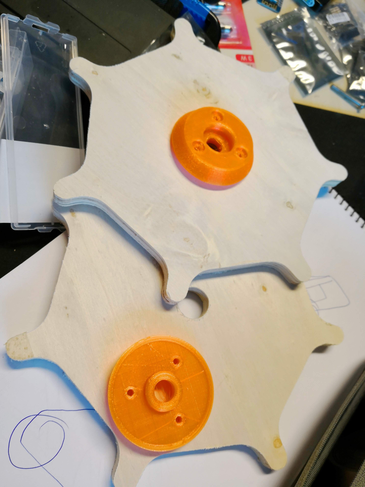
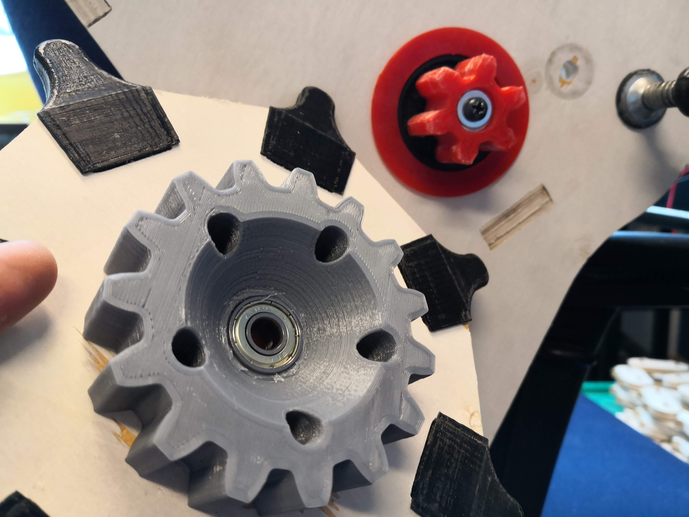
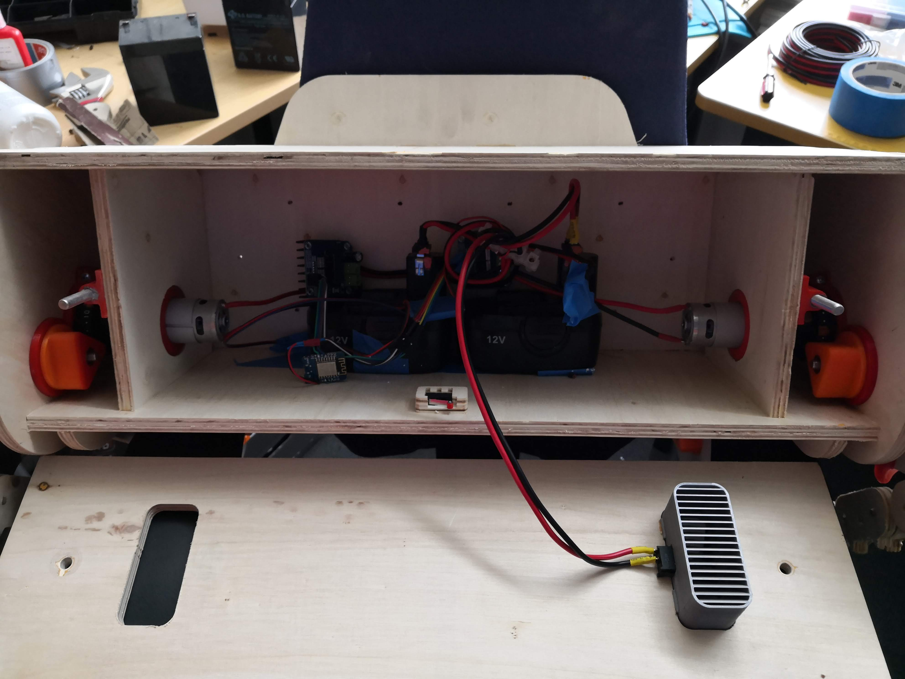
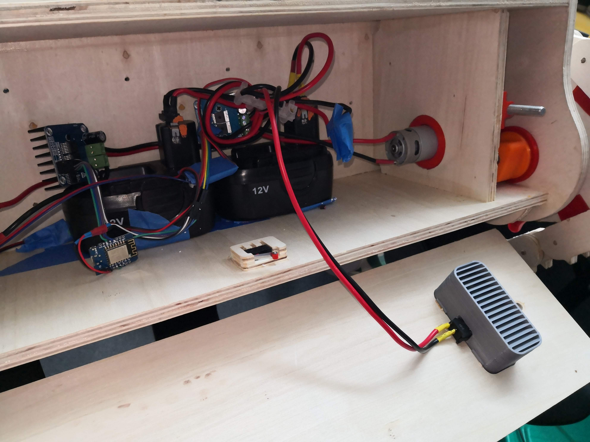

# ePiMP
Electric Powered Intelligent Multipurpose Platform

In short, the ePiMP is a low cost, open source wooden tank robot, that can be constructed by a single sheet of 12 mm plywood, two cheap battery powered drills and few 3d printed parts.

## Fabrication

### Wooden pieces
All the pieces fit in a standard 2.44m by 1.2m sheet of plywood, 12 mm (15/32 in) thickness. The thickness can be changed but that would require changes in some internal slots that interlock, and some plastic pieces that assume 12 mm as the thickness.

The list of parts wooden parts to cut in the CNC is (aprox. 112 total pieces, depending on the version of the design)

#### Already layout sheets (for X-Carve 1000mm or similar with at least 750mm travel per axis)

The layout use 790mm square sheets:

  

https://github.com/innovationgarage/epimp-body/blob/master/platform/svg/Workpiece%2038%20(ALL%20(unique)%20PIECES%20v1.1)/nested_optimized3.svg

#### Unique pieces

https://github.com/innovationgarage/epimp-body/blob/master/platform/svg/Workpiece%2038%20(ALL%20(unique)%20PIECES%20v1.1)/design.svg

The required quantity of the pieces is:

%20PIECES%20v1.1)/quantity.PNG)

### Plastic pieces
The list of needed printed parts is (56 total pieces):
https://github.com/innovationgarage/epimp-body/tree/master/platform/stl

## Assembly
You need the following parts and tools for the assembly:
* Wood glue
* Screwdrivers and wrenches
* 4x M8 long bolts (>10 cm) for the wheels
* 6x M8 inserts
* 2x M8 short bolts (>4 cm) for the back cover
* 2x M6 bolts and nut set for the clutch holder for the drills
* 2x cheap drills https://www.biltema.no/verktoy/el-verktoy/boremaskiner/drillskrutrekker-cd-12v-2000028475
* 8x skateboard ball bearings (608Z)
* 28x M6, 15 mm wood screws for the wheel center part that holds the bearings
* M5, 12 mm wood screws 
* M8 washers

### Wooden body

### Tank tracks
The tank tracks require 64x 6mm thick by 40 mm length wooden dowels https://www.aliexpress.com/item/32908209214.html. Before cutting the link pieces, test the fit of your dowels to ensure the friction between the outer parts is enough to hold everything without glue.

### Wheels and gears
The assembly is the following:

 

The wooden wheels go in between two bearing holders, using 3 of the M6 woodscrews per side. The two wheels on the back have the big gear in the interior side instead:

### Drive and electric system
The brain is a ESP8266 that allows you to remote control the robot via Blynk and serial. The following parts are required:
* ESP8266 board, like a Wemos D1
* 2x 43A motor controller https://www.amazon.com/HiLetgo-BTS7960-Driver-Arduino-Current/dp/B00WSN98DC
* Thick wire (14AWG or lower)
* Screw terminals for joining wire

    

This is the firmware for the ESP8266: https://github.com/innovationgarage/epimp-body/tree/master/firmware/blynk_remote
QR code for cloning the Blynk app:

Remember to create a new Auth code, and fill the `credentials.h` file with your own information.
