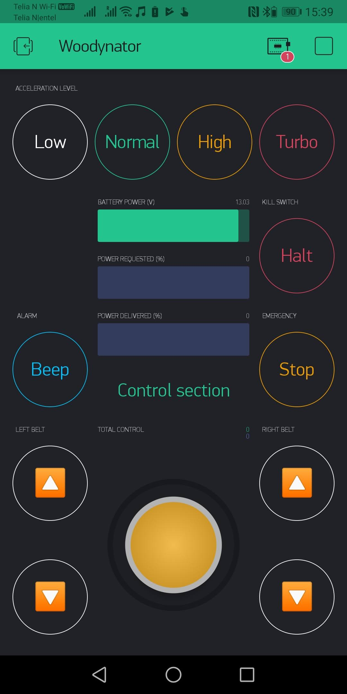

## Serial CLI

The default is 8 data bits, no parity, one stop bit, bauds 115200.

    Innovation Garage AS - Woodynator-MK2 Build DATE TIME
    Available commands: 
    stop
    beep [-melody <0>]
    reboot [-force]
    help
    status
    move -x <value> -y <value> [-smoothing <1>]
    belts -left <value> -right <value> [-smoothing <1>]

### Details

- `beep`: Melody number from https://github.com/innovationgarage/epimp-body/blob/master/firmware/blynk_remote/melody.ino

- `reboot`: -force triggers `ESP.reset()` instead of `ESP.restart()`

- `move` and `belts`: -smoothing is the factor used here: https://github.com/innovationgarage/epimp-body/blob/master/firmware/blynk_remote/blynk_remote.ino#L127 in few words, if is 1 it will be a direct relationship. If is 2 it will be "half" of the setpoint every 100 ms, and so on

## Blynk

